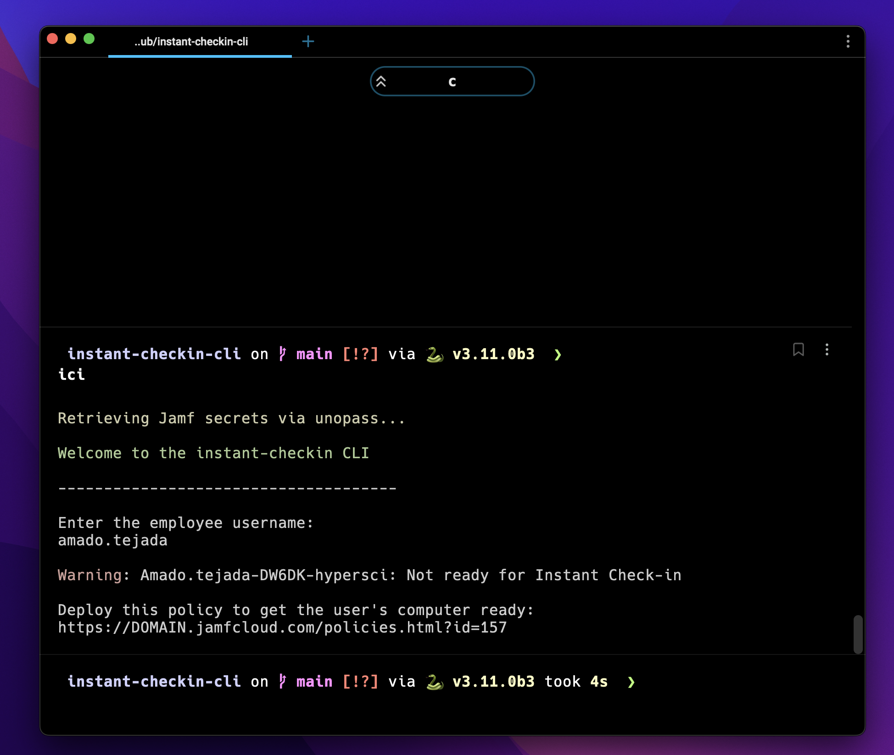

# instant-checkin-cli
##### Written by [Amado Tejada](https://www.linkedin.com/in/amadotejada/)
##

*instant-checkin-cli* is a companion CLI tool for [instant-checkin](https://github.com/amadotejada/instant-checkin) 

*instant-checkin-cli* allows you to force remote computers to check-in to Jamf MDM via the terminal

 
 

## Requirements
-  python 3.6+
- `pip install -r requirements.txt`
- [unopass](https://github.com/amadotejada/unopass) configured with your API credentials
- [instant-checkin](https://github.com/amadotejada/instant-checkin) configured

## Jamf API
*instant-checkin-cli* uses [unopass](https://github.com/amadotejada/unopass) to retrieve your Jamf API credentials at runtime. Set them up in your 1Password account.

Create a Jamf standard user with the minimum permissions to use *instant-checkin-cli*

- Permissions
    * Computers: Read, Update
    * Users: Update

Upload your API credentials to 1Password to use it with unopass

## Usage

1. add an alias shortcut to your shell:
    - E.g `alias ici="python3 instant-checkin-cli.py"`

2. use the shortcut:
    - `ici`

3. [unopass](https://github.com/amadotejada/unopass) will retrieve your Jamf API credentials

4. Enter the username of the user you want to check-in

5. A list of computers for that  user will be displayed - Select one

6. Profit - Profile will be sent to computer instantly for immediate check-in

## Other
When users are not found in Jamf

When users are not ready for Instant Check-in

Workflow

##
### License

*instant-checkin-cli* is released under the [MIT License](https://github.com/amadotejada/instant-checkin-cli/blob/main/LICENSE)
